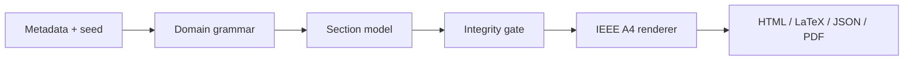

<div align="center">
  
  <h1>EarthSCIgen</h1>
  <p><strong>Automatic Earth Science Preprint Generator</strong></p>
  <p>Transparent IEEE-style scientific scaffolds, generated entirely in your browser.</p>

  [](https://github.com/Base27-CVNSS/EarthSCIgen/releases)
  [](./LICENSE)
  [](https://base27-cvnss.github.io/EarthSCIgen/)
  [](./index.html)
</div>

> [!WARNING]
> EarthSCIgen generates **synthetic, unreviewed document scaffolds**. Its output
> is not scientific evidence and must never be represented as genuine research.

## Languages

[🇻🇳 Tiếng Việt](./README.vi.md) · [🇬🇧 English](./README.en.md)

## Overview

EarthSCIgen adapts the grammar-driven spirit of SCIgen to Earth Sciences with
a strict transparency boundary. It is designed for teaching, software testing,
reproducibility exercises, interface evaluation, and early manuscript planning.

The application is plain HTML, CSS, and JavaScript. Open `index.html`, or use
the hosted GitHub Pages site—there is no installation, build step, account,
API key, database, analytics service, or environment variable.

### Core capabilities

- 🌍 Six modules: Remote Sensing, Geology, Hydrology, Climate Science,
  Geomorphology, and Geophysics.
- 🧾 Author, email, affiliation, title, target length, and reproducible seed.
- 📐 Live 6–8 page A4 preview with an IEEE-style two-column outline.
- 📦 Browser-side export to standalone HTML, IEEEtran LaTeX, and manifest JSON.
- 🖨️ Native browser print dialog for printing or saving directly to PDF.
- 🧪 Generation progress log and seven integrity checks.
- 🎨 Three responsive UI systems: Editorial, Atlas, and Strata.
- 🔒 Synthetic warning embedded in the interface and every exported format.

## Quick start

1. Open the [live application](https://base27-cvnss.github.io/EarthSCIgen/).
2. Select a discipline and complete the document metadata.
3. Choose 6, 7, or 8 pages and set a seed.
4. Review the live preview and integrity checks.
5. Generate, export, or choose **Print / PDF**.

## Architecture



Everything runs locally in the browser. The deployed site contains no network
request in its runtime code.

## Verification

```bash
npm run check
npm test
```

Tests use Node.js built-ins only; no dependency installation is required.
Deployment runs the same checks before GitHub Pages publishes the site.

## Ethics and acceptable use

EarthSCIgen is not a paper mill and does not manufacture scientific evidence.
Users are responsible for replacing synthetic material with verified data,
checking every claim and citation, documenting provenance and uncertainty, and
obtaining appropriate human and institutional review.

## License

Released under the [MIT License](./LICENSE). Copyright © 2026 Long Ngo.
